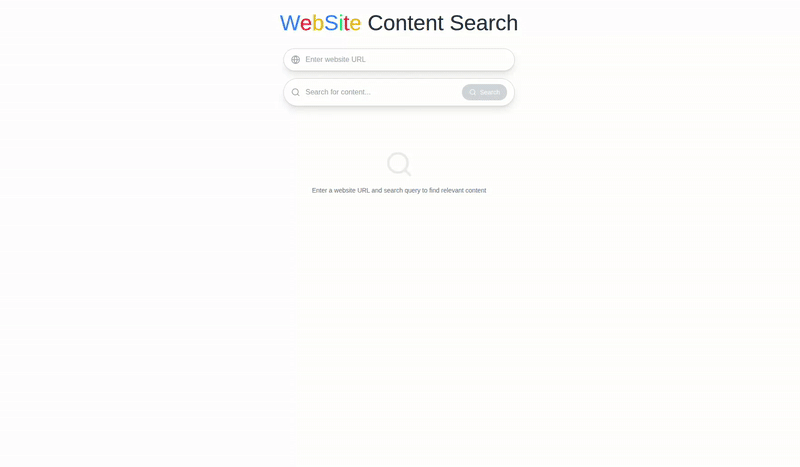

# 🔍 HTML Search SPA

A full-stack semantic search tool for crawling, chunking, and vectorizing HTML content from any public website URL.

### 🎥 Demo



### 🌐 Features

- Accepts any public website URL.
- Parses and chunks HTML content.
- Indexes with Weaviate vector database.
- Lets you search semantically across website content.
- Shows match percentage, context preview, and raw HTML.

---

### 🛠️ Tech Stack

- Frontend: Next.js
- Backend: Python (Flask)
- Vector DB: Weaviate
- NLP Embedding: HuggingFace SentenceTransformer (all-MiniLM-L6-v2)

---

### 🚀 Running the Project

1. **Backend**

```bash
cd backend
python3 -m venv venv
source venv/bin/activate
pip install -r requirements.txt
python app.py
```

2. **Frontend**
```
cd frontend
npm install
npm run dev
```
3. **Vector DB**
```
docker-compose up -d
```


## 📁 Folder Structure
```
html-search-spa/
├── backend/
│ ├── app.py
│ ├── utils/
│ ├── requirements.txt
├── frontend/
│ ├── public/
│ ├── src/
│ │ ├── App.jsx
│ │ ├── components/
│ ├── tailwind.config.js
│ ├── package.json
├── weaviate/
│ ├── docker-compose.yml
├── README.md
├── .gitignore
```

## To Push to GitHub

```bash
git init
git add .
git commit -m "Initial commit: HTML Search SPA"
git remote add origin https://github.com/your-username/your-repo.git
git push -u origin main
```

## 📃 License

MIT License © 2025 Sayan Debnath
